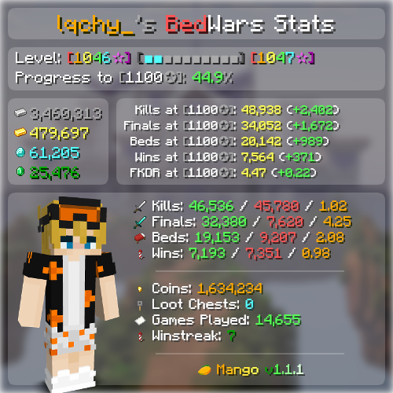

  <h1>🥭 <strong>Mango</strong> 🥭</h1>

*Mango* is an advanced Bedwars statistics Discord bot that generates images with accurate and up-to-date Bedwars information of any user.

This bot is made using [DiscordJS](https://discordjs.dev/), and utilises the [Public Hypixel API](https://api.hypixel.net/#section/Introduction), combined with [PlayerDB](https://playerdb.co/) and (soon) [Polsu](https://api.polsu.xyz/).

- - -
## **Example Response**

- - -

  <h2>✨ Currently <em>Mango</em> can display ✨</h2>
<!--   <ul>
    <li>Current Level</li>
    <li>Current Prestige</li>
    <li>Kills</li>
    <li>Deaths</li>
    <li>Beds</li>
    <li>Averages</li>
    <li>Collected Resources</li>
    <li>Predictions about future stats</li>
    <li>Predictions about future stats</li>
  </ul> -->
    » Current Level « 
    » Current Prestige « 
    » Kills « 
    » Deaths « 
    » Beds « 
    » Averages « 
    » Collected Resources « 
    » Predictions about future stats « 
    » Session information « 

- - -
## 📝 Notes 📝
*Currently, this bot is under heavy development and is not yet finished.*

<!-- KEEP THESE  s otherwise layout kinda gets a tinyyy bit destroyed under the license part-->
## ⚖ License ⚖
This project is protected under the [MIT License](https://github.com/SampleSpaceDev/Mango/blob/master/LICENSE)  

